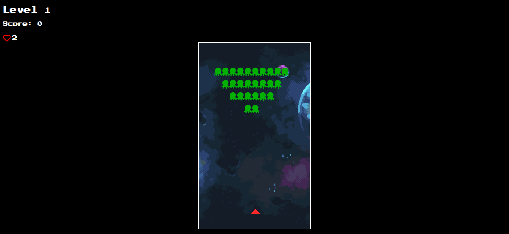

    <h1>👾 Infinite Space Shooter 🤖</h1>
    
     
    
Welcome

    
🚧Under construction🚧

    

        <a href="#about">About 💬</a> |
        <a href="#controls">Controls 🎮</a>
    

 
 
 

# About

Introduction

Infinite Space Shooter is a Game developed using
HTML, CSS and JavaScript. This game was developed to study more about this amazing programming language called JavaScript and do something differrent to challenge a little more me and my knowledge.

 

About the Game

The Game counts with six different templates to spawn Invaders, your objective is shoot and destroy them all with your tiny red spaceship called H300.

To keep things interesting, the invaders and how amount of they are spawned in a random template every time when you die, goes to next level or refresh the page.

In the corner of page you have your status, like how many lives remain, your score and the level. When you goes to another level, the invaders will more fast and more harder to hit so give your best to get far and do many points. 
When your lives finish the game will stop and you can check how many points you did and what level you stopped.

 
 
 

# Controls

🔼 - Arrow Up: Shoot!

◀️ - Arrow left: Move spaceship to left

▶️ - Arrow rigth: Move spaceship to rigth

